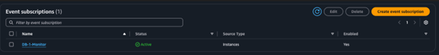

# Triển khai quản lý sự kiện cơ sở dữ liệu toàn diện bằng cách sử dụng thông báo gốc của Amazon RDS và EventBridge

Bài viết này trình bày cách AWS Enterprise Support đã giúp một khách hàng dịch vụ tài chính triển khai giải pháp giám sát sự kiện cơ sở dữ liệu toàn diện. Giải pháp này sử dụng thông báo gốc của Amazon Relational Database Service (Amazon RDS) và Amazon EventBridge.

# Giới thiệu

Trong ngành dịch vụ tài chính, độ tin cậy của cơ sở dữ liệu và bảo trì được kiểm soát là vô cùng quan trọng. Hệ thống cơ sở dữ liệu là xương sống của các hoạt động tài chính quan trọng và xử lý mọi thứ, từ giao dịch thời gian thực đến báo cáo theo quy định và tính toán quản lý rủi ro. Bất kỳ thời gian ngừng hoạt động hoặc sự không nhất quán dữ liệu nào cũng có thể gây ra hậu quả nghiêm trọng, có khả năng ảnh hưởng đến hàng triệu khách hàng và các giao dịch trị giá hàng tỷ đô la. Gần đây, [AWS Enterprise Support](https://aws.amazon.com/premiumsupport/business-support-enterprise-support/) đã giúp một khách hàng dịch vụ tài chính triển khai một hệ thống giám sát sự kiện cơ sở dữ liệu mạnh mẽ. Với hệ thống này, khách hàng có thể kiểm soát các hoạt động bảo trì đồng thời đáp ứng các yêu cầu về tính ổn định hoạt động và tuân thủ.

Trong bài viết này, chúng ta sẽ tìm hiểu các chủ đề sau:

Cách AWS Enterprise Support hợp tác với khách hàng để thiết kế và triển khai giải pháp giám sát cấp doanh nghiệp.

Các phương pháp hay nhất về mặt kỹ thuật để giám sát sự kiện cơ sở dữ liệu, bao gồm đăng ký sự kiện Amazon RDS, khung thông báo [EventBridge](https://docs.aws.amazon.com/eventbridge/latest/userguide/eb-what-is.html) và quản lý sự kiện bảo trì ở quy mô lớn.

# Chủ động giải quyết những thách thức của khách hàng

Một tổ chức dịch vụ tài chính hàng đầu vận hành ứng dụng ngân hàng cốt lõi quan trọng trên AWS sử dụng Amazon RDS làm thành phần kiến trúc chủ chốt. Một trong những vấn đề chính mà khách hàng gặp phải là quản lý bảo trì liên quan đến cơ sở dữ liệu. Để giải quyết vấn đề này, giải pháp cần bao gồm các tính năng sau:

- Thông báo trước về tất cả các bản cập nhật hệ điều hành và công cụ cơ sở dữ liệu.
- Kiểm soát chặt chẽ thời gian bảo trì để phù hợp với khung thời gian bảo trì đã được phê duyệt trước.
- Không có bảo trì hệ thống bất ngờ.

Ban đầu, khách hàng đã cấu hình thông báo sự kiện Amazon RDS, nhưng gặp sự cố sau khi khôi phục cơ sở dữ liệu với cùng tên, dẫn đến việc bỏ lỡ thông báo bảo trì. Tình huống này khiến họ có nguy cơ ngừng hoạt động bất ngờ và vi phạm quy định tiềm ẩn.

Khi AWS Support hỗ trợ khách hàng, trọng tâm của họ là cung cấp hướng dẫn toàn diện, hướng đến giải pháp và triển khai các phương pháp hay nhất của AWS. Các hoạt động của AWS Support không chỉ được xây dựng để giải quyết các thách thức kỹ thuật tức thời mà còn nâng cao độ tin cậy tổng thể về kiến trúc và hiệu quả hoạt động. Đối với khách hàng này, AWS Support đã làm việc theo phương pháp tiếp cận có hệ thống, kết hợp chuyên môn kỹ thuật với các yêu cầu tuân thủ cụ thể của ngành.

AWS Enterprise Support đã hợp tác với khách hàng qua các giai đoạn sau:

**Đánh giá ban đầu**

- Đã xem xét thiết lập thông báo hiện có và xác định các thiếu sót. Các vấn đề thường gặp bao gồm danh mục sự kiện bị cấu hình sai, các phiên bản cơ sở dữ liệu bị thiếu và đường dẫn thông báo bị hỏng.
- Đã phát hiện các vấn đề thông báo đối với cơ sở dữ liệu được khôi phục. Những vấn đề này là một sự cố thường gặp khi khôi phục cơ sở dữ liệu từ ảnh chụp nhanh và có thể ảnh hưởng đến việc giám sát hoạt động quan trọng.
- Đã làm rõ các yêu cầu đối với việc theo dõi sự kiện bảo trì. Để duy trì lịch sử kiểm tra các hoạt động bảo trì theo lịch trình, hoạt động sao lưu và thay đổi cấu hình, chúng tôi phải hiểu rõ các yêu cầu của khách hàng.

**Giải quyết sự cố**

- Đã điều tra trạng thái đăng ký sự kiện, hiện là all-sources-delete. Trạng thái này cho biết tất cả các mã định danh nguồn đã bị xóa, và đây là một sự cố thường gặp khi cơ sở dữ liệu bị xóa mà không được dọn dẹp đăng ký sự kiện đúng cách.
- Đã hỗ trợ tạo lại chính xác các đăng ký sự kiện gốc. Các đăng ký được tạo lại tuân theo cấu hình phù hợp cho loại nguồn, danh mục sự kiện và cài đặt chủ đề Amazon Simple Notification Service (Amazon SNS) để tránh các khoảng trống thông báo.
- Đã ghi lại các phương pháp hay nhất để duy trì độ tin cậy của thông báo trong quá trình thay đổi vòng đời cơ sở dữ liệu. Các phương pháp hay nhất này bao gồm quy trình giám sát trạng thái thường xuyên và kiểm tra đăng ký.

**Triển khai giải pháp nâng cao**

- Thiết kế khung thông báo EventBridge tùy chỉnh.
- Tạo các quy tắc lọc cho các sự kiện bảo trì cụ thể.
- Triển khai cơ chế ghi nhật ký thân thiện với kiểm toán.

# Triển khai giải pháp toàn diện

Giải pháp giám sát sự kiện cơ sở dữ liệu toàn diện kết hợp hai phương pháp:

- Đăng ký sự kiện gốc Amazon RDS cho các thông báo sự kiện cơ sở dữ liệu cơ bản được xác định trước: Bao gồm cách phân loại các loại sự kiện khác nhau, diễn giải thông báo và cấu hình các mục tiêu thông báo phù hợp dựa trên loại sự kiện.
- Quản lý thông báo nâng cao EventBridge và Amazon SNS: Cung cấp tính năng lọc nâng cao, định dạng thông báo tùy chỉnh và tích hợp với nhiều hệ thống hạ nguồn để thông báo, ghi nhật ký và phản hồi tự động.

Phương pháp kép này cung cấp cả phạm vi bao phủ rộng và khả năng kiểm soát chi tiết đối với các sự kiện cơ sở dữ liệu, đáp ứng các yêu cầu nghiêm ngặt về vận hành và tuân thủ của khách hàng.

## **Điều kiện tiên quyết:**

Trước khi bắt đầu, Bộ phận Hỗ trợ AWS đã đảm bảo khách hàng có những điều kiện sau:

- Các phiên bản của cơ sở dữ liệu Amazon RDS đang hoạt động.
- Quyền AWS Identity and Access Management (IAM) đã phù hợp để cấu hình đăng ký sự kiện Amazon RDS.
- Chủ đề [Amazon SNS](https://docs.aws.amazon.com/sns/latest/dg/welcome.html) để nhận thông báo.
- Quyền cấu hình quy tắc EventBridge để tăng cường kiểm soát.

## Cấu hình đăng ký sự kiện gốc của Amazon RDS

Để thiết lập đăng ký sự kiện Amazon RDS, chúng tôi đã hướng dẫn khách hàng **đăng ký nhận thông báo sự kiện Amazon RDS.**

## Tìm hiểu trạng thái đăng ký sự kiện

Khi được cấu hình đúng với các phiên bản cơ sở dữ liệu khả dụng, đăng ký sẽ hiển thị trạng thái Đang hoạt động. Trạng thái này cho biết đăng ký đã sẵn sàng để gửi thông báo.



Tuy nhiên, khi các phiên bản được giám sát bị xóa, trạng thái đăng ký đã thay đổi thành "all-sources-deleted". Trạng thái này cho biết các tài nguyên được giám sát không còn khả dụng nữa.


**Những cân nhắc quan trọng**

Khi hỗ trợ khách hàng triển khai giải pháp, chúng tôi phải lưu ý những vấn đề tiềm ẩn sau:

- Nếu khách hàng xóa và tạo lại các instances có cùng tên, họ phải tự tay thêm chúng vào subscription.
- Nếu khách hàng khôi phục các phiên bản từ snapshots, họ phải cấu hình lại đăng ký sự kiện.
- Nếu khách hàng sử dụng tất cả các **instances** trong subscription của mình, họ cũng sẽ tự động thêm các instances mới.

# **Ví dụ về thông báo sự kiện**

Khi chúng tôi cấu hình đăng ký sự kiện Amazon RDS cho khách hàng và xác nhận trạng thái Đang hoạt động, khách hàng đã nhận được nhiều loại thông báo khác nhau dựa trên cấu hình đăng ký nhận thông báo (subscription settings).

Sau đây là ví dụ về các email thông báo quan trọng mà khách hàng đã nhận được:

Bản cập nhật hệ điều hành khả dụng:


Thông báo này thông báo cho khách hàng về các bản cập nhật hệ điều hành khả dụng và bao gồm các thông tin sau:

Mã định danh phiên bản Amazon RDS bị ảnh hưởng

Loại cập nhật, chẳng hạn như bản cập nhật hệ thống

Liên kết bảng điều khiển đến tài nguyên Amazon RDS

Bản cập nhật công cụ cơ sở dữ liệu khả dụng:


Thông báo này cảnh báo khách hàng về các bản cập nhật công cụ cơ sở dữ liệu khả dụng và bao gồm các thông tin sau:

- Chi tiết phiên bản Amazon RDS
- Bản cập nhật khả dụng, chẳng hạn như bản nâng cấp phiên bản nhỏ của phiên bản DB
- Liên kết bảng điều khiển đến phiên bản Amazon RDS

Những thông báo này cho phép quản lý chủ động các phiên bản Amazon RDS và tạo điều kiện thuận lợi cho các hoạt động bảo trì theo kế hoạch, rất quan trọng để đáp ứng các yêu cầu tuân thủ của khách hàng dịch vụ tài chính.

## Cải thiện thông báo với EventBridge

Để đạt được khả năng kiểm soát chi tiết hơn, AWS Support đã hỗ trợ triển khai các quy tắc EventBridge để bổ sung cho các đăng ký sự kiện gốc của Amazon RDS.

Để triển khai các quy tắc EventBridge cho các sự kiện Amazon RDS, hãy xem mục [Tạo quy tắc](https://docs.aws.amazon.com/AmazonRDS/latest/UserGuide/rds-cloud-watch-events.html#rds-create-rule).

Ví dụ về mẫu quy tắc EventBridge:

```json
{
    "source": ["aws.rds"],
    "detail-type": ["RDS DB Instance Event"],
    "detail": {
        "EventID": [
            "RDS-EVENT-0026",
            "RDS-EVENT-0027",
            "RDS-EVENT-0047",
            "RDS-EVENT-0155",
            "RDS-EVENT-0178"
        ]
    }
}
```

Mẫu này ghi lại các sự kiện bảo trì quan trọng, bao gồm thông báo bảo trì theo lịch trình, yêu cầu khởi động lại, thao tác sao lưu và khôi phục, cũng như thay đổi cấu hình. Để biết danh sách đầy đủ các sự kiện, hãy xem [Danh mục sự kiện Amazon RDS và Thông báo sự kiện](https://docs.aws.amazon.com/AmazonRDS/latest/UserGuide/USER_Events.Messages.html).

## Thiết lập thông báo mục tiêu với Amazon SNS

Để quản lý các kịch bản bảo trì cụ thể và đáp ứng các yêu cầu kiểm tra, chúng tôi đã hoàn thành các nhiệm vụ sau:

- Chúng tôi đã tạo các chủ đề Amazon SNS riêng biệt cho các danh mục sự kiện khác nhau, chẳng hạn như bảo trì quan trọng hoặc sao lưu định kỳ.
- Chúng tôi đã cấu hình các quy tắc EventBridge để định tuyến các sự kiện đến các chủ đề Amazon SNS liên quan.
- Chúng tôi đã triển khai tính năng lọc tin nhắn trong Amazon SNS cho các loại sự kiện cụ thể hơn.
- Chúng tôi đã sử dụng các bộ lọc đăng ký Amazon SNS để cấu hình các đường dẫn leo thang cho các sự kiện bảo trì quan trọng.

### **Sử dụng EventBridge cho các tình huống nâng cao**

EventBridge mang lại một số lợi thế cho việc quản lý sự kiện chi tiết:

- Bạn có thể lọc sự kiện dựa trên các thuộc tính cụ thể, nhiều hơn những gì mà đăng ký gốc Amazon RDS cho phép.
- Bạn có thể định tuyến các loại sự kiện khác nhau đến các mục tiêu khác nhau, chẳng hạn như các sự kiện quan trọng đến hệ thống phân trang hoặc các sự kiện thông tin đến hệ thống ghi nhật ký.
- Bạn có thể triển khai các mẫu sự kiện tùy chỉnh cho các tình huống lọc phức tạp.
- Bạn có thể thiết lập nhiều mục tiêu cho cùng một quy tắc sự kiện, chẳng hạn như thông báo cho nhóm vận hành và khởi động các hàm Lambda để xử lý tùy chỉnh.

Ví dụ về quy tắc EventBridge để lọc các sự kiện cụ thể của phiên bản Amazon RDS:

```json
{
    "source": ["aws.rds"],
    "detail-type": ["RDS DB Instance Event"],
    "detail": {
        "SourceType": ["DB_INSTANCE"],
        "SourceIdentifier": ["your-db-instance-name"],
        "EventCategories": ["maintenance"]
    }
}
```

### Duy trì giám sát hiệu quả

AWS Support đã cung cấp các phương pháp tối ưu sau đây để khách hàng tạo ra hệ thống giám sát liên tục đáng tin cậy:

**Hoàn tất bảo trì thường xuyên**

- Xác minh trạng thái đăng ký sự kiện cho dịch vụ Amazon RDS gốc.
- Ghi lại tất cả các phiên bản được giám sát và cấu hình đăng ký sự kiện của chúng.
- Kịp thời điều tra trạng thái tất cả các nguồn đã bị xóa.
- Xem xét và cập nhật các quy tắc EventBridge và định tuyến thông báo.

**Tạo quy trình quản lý thay đổi**

- Sau khi khôi phục hoặc tạo lại phiên bản, hãy cập nhật cấu hình đăng ký của bạn.
- Duy trì các quy trình để thêm lại phiên bản vào đăng ký.
- Ghi lại mọi thay đổi đối với thiết lập giám sát của bạn.
- Theo dõi các thay đổi trạng thái trong đăng ký sự kiện.

**Chuẩn bị và hỗ trợ nhóm của bạn**

- Luôn cập nhật tài liệu cho cả đăng ký Amazon RDS và quy tắc EventBridge.
- Đào tạo thành viên nhóm về quy trình phản hồi thông báo.
- Thiết lập lộ trình xử lý cho các thông báo quan trọng.
- Thường xuyên xem xét và cập nhật thông tin liên hệ.

# Kết luận

Bằng cách sử dụng AWS Enterprise Support, khách hàng dịch vụ tài chính đã triển khai thành công một hệ thống giám sát sự kiện cơ sở dữ liệu toàn diện, đáp ứng các yêu cầu nghiêm ngặt về vận hành và tuân thủ. Giải pháp kết hợp đăng ký sự kiện gốc Amazon RDS với các quy tắc EventBridge, cung cấp cả phạm vi sự kiện rộng và khả năng kiểm soát chi tiết.

Phương pháp này mang lại cho khách hàng những lợi ích sau:

- Thông báo kịp thời về tất cả các bản cập nhật hệ thống và sự kiện bảo trì.
- Kiểm soát chặt chẽ thời gian bảo trì.
- Theo dõi kiểm toán toàn diện cho mục đích tuân thủ.
- Giảm thiểu rủi ro do các thay đổi hệ thống bất ngờ.

Hãy nhớ thường xuyên xem xét và cập nhật cấu hình thông báo của bạn, đặc biệt là sau khi vòng đời cơ sở dữ liệu thay đổi. Việc xem xét này giúp bạn duy trì một khuôn khổ giám sát đáng tin cậy, tiếp tục đáp ứng các nhu cầu kinh doanh đang phát triển của bạn.

Để tìm hiểu thêm về cách AWS Support có thể giúp bạn tối ưu hóa hoạt động cơ sở dữ liệu và chiến lược giám sát trong khi vẫn đáp ứng các yêu cầu tuân thủ, hãy truy cập AWS Support.

# Về các tác giả


**Tejas Majamudar**

Tejas Majamudar là Quản lý Khách hàng Kỹ thuật Cấp cao tại Amazon Web Services, nơi ông hợp tác với khách hàng để đạt được sự vận hành xuất sắc và tối ưu hóa cơ sở hạ tầng đám mây của họ. Với tư cách là cố vấn, Tejas giúp các tổ chức triển khai các chiến lược quản lý rủi ro hiệu quả và các sáng kiến tối ưu hóa chi phí. Bằng cách này, các tổ chức có thể tối đa hóa giá trị đầu tư vào AWS.


**Sathik M**

Sathik M là Quản lý Tài khoản Kỹ thuật tại AWS, chuyên về CNTT Doanh nghiệp và điện toán đám mây. Sathik sở hữu kiến thức sâu rộng về tối ưu hóa và bảo mật các triển khai Linux quy mô lớn trên nhiều lĩnh vực. Là chuyên gia về Amazon Elastic Compute Cloud (Amazon EC2) Linux, Amazon ElastiCache và Amazon FSx for NetApp ONTAP, Sathik đã dẫn dắt nhiều dự án hợp tác với khách hàng. Anh giúp khách hàng đạt được hiệu suất và độ tin cậy chưa từng có trong cơ sở hạ tầng đám mây của họ.