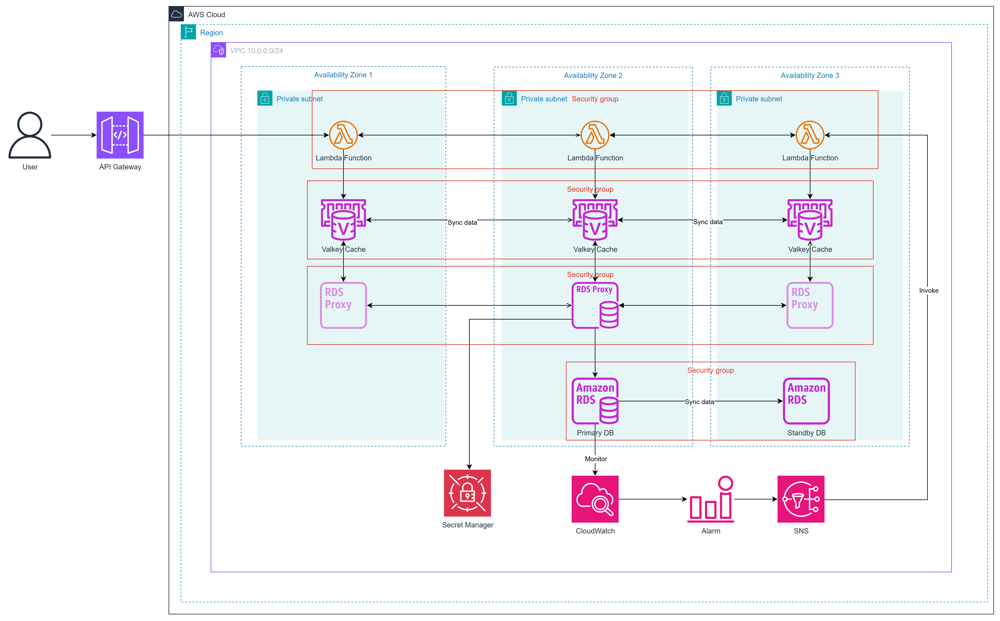
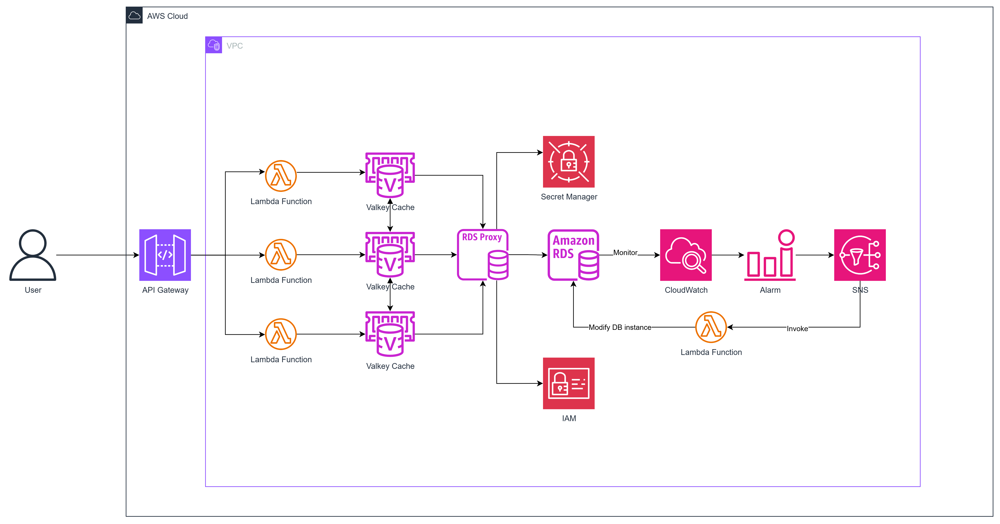

# Serverless Database Operations với RDS Proxy và Lambda

## Khai Thác AWS Để Quản Lý Cơ Sở Dữ Liệu Có Khả Năng Mở Rộng, Tiết Kiệm Chi Phí Với RDS Proxy, Lambda Và ElastiCache

**Implement database operations layer với RDS Proxy, connection pooling, query optimization, caching, monitoring.** 

---

# **Executive Summary**

Trong bối cảnh thương mại điện tử đang phát triển nhanh chóng, các hệ thống cơ sở dữ liệu legacy gặp khó khăn với các nút thắt cổ chai về khả năng mở rộng, chi phí bảo trì cao và chi phí ngày càng tăng, đặc biệt trong các mùa cao điểm như Black Friday. Các hệ thống truyền thống thường dẫn đến việc sử dụng tài nguyên kém hiệu quả từ 20–30% và chi phí vận hành cao hơn 40–70% so với các giải pháp serverless, theo các số liệu chuẩn ngành. Đề xuất này giải quyết một vấn đề thực tế: Hiện đại hóa một nền tảng thương mại điện tử legacy để xử lý lưu lượng truy cập tăng gấp 10 lần trong các mùa cao điểm, đồng thời giảm 50% chi phí vận hành, từ khoảng 4.000 USD/tháng với hạ tầng truyền thống xuống 2.000 USD/tháng với serverless.

Theo nghiên cứu thị trường, Gartner dự báo chi tiêu toàn cầu cho điện toán đám mây công cộng sẽ đạt 723 tỷ USD vào năm 2025, tăng 21,5%, với 90% tổ chức sẽ áp dụng hybrid cloud vào năm 2027. Thị trường điện toán serverless được dự đoán sẽ tăng trưởng với tốc độ CAGR 23,7% đến năm 2030, cho phép các doanh nghiệp áp dụng đạt được mức giảm chi phí từ 50–90%, như đã thấy trong các nghiên cứu điển hình như Taco Bell tiết kiệm 90% chi phí cho hệ thống thương mại điện tử khi chuyển sang AWS serverless. [[https://aws.amazon.com/vi/partners/success/taco-bell-trek10/](https://aws.amazon.com/vi/partners/success/taco-bell-trek10/)]

[https://www.gartner.com/en/newsroom/press-releases/2024-11-19-gartner-forecasts-worldwide-public-cloud-end-user-spending-to-total-723-billion-dollars-in-2025]

Các thách thức chính bao gồm tình trạng cạn kiệt kết nối và truy vấn chậm, gây ra mức giảm 7% trong tỷ lệ chuyển đổi cho mỗi giây trễ, có thể khiến các nhà bán lẻ tầm trung thiệt hại khoảng 100.000 USD mỗi năm, và thời gian ngừng hoạt động trung bình gây tổn thất từ 300.000 đến 1 triệu USD mỗi giờ đối với các doanh nghiệp lớn. Các bên liên quan — đội ngũ CNTT, lãnh đạo doanh nghiệp, khách hàng và bộ phận tuân thủ — phải đối mặt với tình trạng kém hiệu quả, rào cản tăng trưởng, mất lòng tin và rủi ro về tuân thủ quy định. Việc không hành động sẽ dẫn đến bất lợi cạnh tranh trong một thế giới ưu tiên điện toán đám mây.

Giải pháp tập trung serverless trên AWS nhấn mạnh thành phần cho nhiều tác vụ: Lambda cho CRUD dựa sự kiện, chèn hàng loạt, truy vấn và mở rộng; RDS Proxy cho tập hợp kết nối, giảm overhead 60% trong môi trường serverless; ElastiCache Serverless cho lưu trữ tạm thời, cắt cuộc gọi DB 90% để đạt phản hồi <500ms; và tự động mở rộng tùy chỉnh cho RDS MySQL dùng CloudWatch, SNS, Lambda điều chỉnh động dựa CPU (>60%), đảm bảo mở rộng tiết kiệm.

Các tính năng chính bao gồm kết nối pooling qua RDS Proxy để xử lý lên đến 50.000 người dùng đồng thời, bộ đệm trong bộ nhớ với ElastiCache để giảm độ trễ truy vấn từ 3,2 giây xuống dưới 500ms, và các Serverless Lambda cho các hoạt động CRUD, chèn hàng loạt và truy vấn. Thiết lập này đảm bảo tính khả dụng cao với triển khai Multi-AZ, bảo mật mạnh mẽ thông qua vai trò IAM và điểm cuối VPC, và tự động mở rộng dựa trên việc sử dụng CPU.

Bảng so sánh hiệu quả chi phí giữa **RDS MySQL Multi-AZ Custom AutoScaling** và **Aurora Serverless v2**

| **Tiêu chí** | **RDS MySQL Multi-AZ Custom AutoScaling** | **Aurora Serverless v2** |
| --- | --- | --- |
| **Tổng chi phí** | ~$73.48/tháng | ~$94.82/tháng |
| **Compute** | $30.66 (db.t4g.micro, Multi-AZ) | $52.56 (0.5 ACU) |
| **Lưu trữ** | $2.76 (20 GB gp3) | $2.4 (20 GB) |
| **Backup** | $2.22 (20 GB) | $2.22 (20 GB) |
| **CloudWatch/SNS/Lambda** | $0.20 (2 alarms + SNS + Lambda) | $0.00022 (Lambda) |
| **Systems Manager Automation (Thay cho SNS/Lambda)** | 100,000 steps/tháng (Miễn phí) | Không cần |
| **RDS Proxy** | $21.9 | $21.9 |
| **ElastiCache** | $15.33 | $15.33 |
| **Secrets Manager** | $0.405 | $0.405 |
| **Hiệu suất** | Phụ thuộc instance, thấp hơn Aurora | Lên đến 5x thông lượng RDS |
| **Thời gian failover** | 60-120 giây | ~30 giây |
---
# 1. Executive Summary

## Tình Hình Hiện Tại

Trong môi trường kinh doanh số hiện nay, các ứng dụng của chúng ta đang phải đối mặt với các mô hình tải không thể đoán trước, có những thời điểm lưu lượng truy cập tăng đột biến (workload spikes) và những khoảng thời gian hoạt động ở mức thấp. Cơ sở dữ liệu Amazon RDS for MySQL hiện tại, với mô hình cấp phát tài nguyên tĩnh, đang tạo ra một thách thức lưỡng nan đáng kể. Chúng ta hoặc phải cấp phát thừa tài nguyên (over-provisioning) để đáp ứng giờ cao điểm, dẫn đến lãng phí chi phí đáng kể trong những giờ hoạt động bình thường, hoặc phải cấp phát thiếu tài nguyên (under-provisioning), gây ra suy giảm hiệu năng, tăng độ trễ và nghiêm trọng hơn là nguy cơ gián đoạn dịch vụ. Tác động của việc này không chỉ dừng lại ở khía cạnh kỹ thuật; nó ảnh hưởng trực tiếp đến tài chính và uy tín thương hiệu. Các nghiên cứu chỉ ra rằng chi phí trung bình của một phút downtime có thể lên tới $5,600, một con số có thể gây thiệt hại hàng trăm nghìn đô la mỗi giờ cho các doanh nghiệp.   

## Các Thách Thức Chính

- **Sự xung đột về mô hình mở rộng:** AWS Lambda có thể mở rộng quy mô từ con số không lên hàng nghìn thực thể (instance) đồng thời chỉ trong vài giây để đáp ứng lưu lượng request. Ngược lại, mỗi instance RDS có một giới hạn vật lý về số lượng kết nối đồng thời (max_connections) mà nó có thể xử lý, một con số bị giới hạn bởi bộ nhớ và CPU của instance đó. Sự chênh lệch tốc độ và mô hình mở rộng này là nguồn gốc của nhiều vấn đề nghiêm trọng.
- **Cạn kiệt Pool kết nối (Connection Pool Exhaustion):** Đây là vấn đề phổ biến nhất. Mỗi thực thể Lambda khi được khởi tạo thường sẽ tạo một kết nối cơ sở dữ liệu mới và giữ nó trong suốt vòng đời của mình. Khi một lượng lớn request đến, hàng trăm hoặc hàng nghìn thực thể Lambda được tạo ra, mỗi thực thể cố gắng thiết lập một kết nối riêng. Điều này nhanh chóng làm cạn kiệt giới hạn max_connections của RDS, dẫn đến lỗi "Too many connections" và từ chối các yêu cầu kết nối mới. Hệ quả là ứng dụng bị treo hoặc ngừng hoạt động hoàn toàn.
- **Cấp phát quá tài nguyên cần thiết:** Chủ doanh nghiệp thường sử dụng RDS MySQL quá mức cần thiết gây lãng phí tài nguyên và tăng chi phí không cần thiết, gây thất thoát kinh tế mà không được hiệu quả.
- **Cấp phát quá ít tài nguyên cần thiết:** Ngược lại, đôi lúc biến động về số lượng người dùng và query tới cơ sở dữ liệu nhưng quá giới hạn CPU của instance, gây tắc nghẽn, xảy ra hiện tượng thắt cổ chai.
- **Quản lý thủ công**: Cần nhân lực để quản lý thủ công các tài nguyên, chưa tự động hóa quy trình gây tốn thời gian và lãng phí nhân lực.

## Tác Động Đến Các Bên Liên Quan

- CNTT/Dev: 20-30% thời gian để bảo trì, gánh nặng bởi can thiệp quản lý thủ công.
- Người dùng: 79% bỏ trang vì kém. Thất vọng với trải nghiệm chậm
- Chủ doanh nghiệp: Mất tiền oan nếu cấp phát quá nhiều tài nguyên cần thiết nhưng lại giảm giá trị doanh nghiệp nếu cấp phát ít tài nguyên hơn mức cần sử dụng.

## Hậu Quả Kinh Doanh

Việc không hành động gì có nguy cơ cạnh tranh  bất lợi trong thị trường nơi 85% doanh nghiệp sẽ áp dụng chiến lược đám mây ưu tiên vào năm 2025, với chi tiêu đám mây công cộng toàn cầu đạt 723,4 tỷ USD. Việc tiếp tục phụ thuộc vào hệ thống legacy có thể dẫn đến mất 25% doanh thu trong các đỉnh cao và cản trở mở rộng vào các thị trường mới.

[[https://www.gartner.com/en/newsroom/press-releases/2024-11-19-gartner-forecasts-worldwide-public-cloud-end-user-spending-to-total-723-billion-dollars-in-2025](https://www.gartner.com/en/newsroom/press-releases/2024-11-19-gartner-forecasts-worldwide-public-cloud-end-user-spending-to-total-723-billion-dollars-in-2025)]
---
# 2. **Solution Architecture**

## AWS Services Used

Hệ thống được thiết kế dựa trên mô hình serverless trên AWS, tập trung vào hiệu suất, tiết kiệm chi phí và khả năng mở rộng. Kiến trúc sử dụng các thành phần chính như RDS MySQL, RDS Proxy, ElastiCache Serverless (Valkey), Lambda, API Gateway, Secrets Manager, CloudWatch Alarm, và SNS để xây dựng một giải pháp quản lý cơ sở dữ liệu hiệu quả.

- **RDS MySQL**
    - **Đặc điểm**: Đơn giản, hiệu quả, tiết kiệm chi phí.
    - **Tính năng**: Sử dụng cấu hình multi-AZ để đảm bảo failover tự động, tăng cường độ tin cậy và khả năng phục hồi khi xảy ra sự cố.
- **RDS Proxy**
    - **Chức năng**: Tập hợp và quản lý kết nối cơ sở dữ liệu, giảm 60% overhead khi làm việc với môi trường serverless.
    - **Lợi ích**: Tối ưu hóa hiệu suất và giảm tải cho RDS, đặc biệt khi kết hợp với Lambda.
- **ElastiCache Serverless (Valkey)**
    - **Chức năng**: Lưu trữ bộ nhớ cache, giảm 90% số lượng gọi tới cơ sở dữ liệu.
    - **Khả năng mở rộng**: Hỗ trợ tối đa 100GB dung lượng và 100K ECPU/s, phù hợp với các ứng dụng có tải cao.
- **Lambda**
    - **Chức năng**: Thực thi các tác vụ serverless, tự động mở rộng theo nhu cầu.
    - **Ứng dụng**: Xử lý logic nghiệp vụ và thực hiện các thao tác quản lý cơ sở dữ liệu.
- **API Gateway**
    - **Chức năng**: Làm lớp API để gọi các hàm Lambda, hỗ trợ các thao tác CRUD (Create, Read, Update, Delete) trên dữ liệu.
    - **Lợi ích**: Cung cấp giao diện đơn giản cho ứng dụng client.
- **Secrets Manager**
    - **Chức năng**: Lưu trữ và quản lý thông tin bảo mật (ví dụ: thông tin kết nối RDS Proxy).
    - **Lợi ích**: Tăng cường bảo mật bằng cách tránh lưu trữ thông tin nhạy cảm trong mã nguồn.
- **CloudWatch Alarm**
    - **Chức năng**: Tạo cảnh báo khi CPU Utilization của RDS instance vượt ngưỡng hoặc thấp hơn giá trị mong đợi.
    - **Ứng dụng**: Giúp giám sát hiệu suất và tối ưu hóa tài nguyên.
- **SNS**
    - **Chức năng**: Gửi sự kiện tới Lambda function để kích hoạt các tác vụ và gửi SMS thông báo tới chủ doanh nghiệp.
    - **Lợi ích**: Đảm bảo thông tin kịp thời và tự động hóa quy trình phản hồi.

## Lợi ích của kiến trúc

- **Hiệu suất**: RDS Proxy và ElastiCache giảm tải đáng kể cho cơ sở dữ liệu, trong khi Lambda đảm bảo xử lý nhanh chóng.
- **Tiết kiệm chi phí**: RDS MySQL đơn giản và ElastiCache serverless giúp tối ưu hóa chi phí vận hành.
- **Khả năng mở rộng**: Lambda và ElastiCache hỗ trợ mở rộng linh hoạt theo tải.
- **Bảo mật**: Secrets Manager và multi-AZ tăng cường bảo vệ dữ liệu.
- **Giám sát**: CloudWatch Alarm và SNS đảm bảo hệ thống được theo dõi và phản ứng kịp thời.

### Sơ đồ kiến trúc (mô tả)

- Người dùng gửi yêu cầu qua API Gateway.
- API Gateway kích hoạt các hàm Lambda để thực hiện CRUD hoặc quản lý tài nguyên.
- Lambda sử dụng RDS Proxy để kết nối tới RDS MySQL (multi-AZ) và ElastiCache (Valkey) để truy vấn cache.
- Secrets Manager cung cấp thông tin bảo mật cho RDS Proxy.
- CloudWatch giám sát CPU Utilization của RDS và kích hoạt Alarm khi vượt ngưỡng.
- SNS nhận thông báo từ Alarm và gửi sự kiện tới Lambda hoặc SMS tới chủ doanh nghiệp.

**Luồng Xử lý Yêu cầu Ứng dụng:** Yêu cầu từ người dùng cuối sẽ đi qua API Gateway và được xử lý bởi các hàm AWS Lambda. Trước khi truy vấn cơ sở dữ liệu, hàm Lambda sẽ kiểm tra Amazon ElastiCache. Nếu dữ liệu cần thiết có sẵn trong cache (cache hit), nó sẽ được trả về ngay lập tức. Nếu không (cache miss), yêu cầu sẽ được chuyển tiếp đến Amazon RDS Proxy. RDS Proxy sẽ quản lý và tối ưu hóa kết nối đến instance Amazon RDS for MySQL. Dữ liệu lấy từ RDS sau đó sẽ được ghi vào cache để phục vụ các yêu cầu trong tương lai.

**Luồng Giám sát và Điều chỉnh Quy mô:** Amazon RDS liên tục gửi các chỉ số hiệu năng đến Amazon CloudWatch. CloudWatch Alarms sẽ theo dõi các chỉ số này. Khi một ngưỡng được xác định trước bị vi phạm (ví dụ: CPU quá cao hoặc quá thấp), một cảnh báo sẽ được gửi đến một chủ đề (topic) của Amazon SNS. SNS sau đó sẽ kích hoạt một hàm Lambda chuyên dụng (Scaling Lambda), hàm này sẽ thực hiện lệnh gọi API để thay đổi kích thước của instance RDS.

---
# 3. Technical Implementation

- Cấu hình RDS MySQL với multi-AZ và kết nối qua RDS Proxy.
- Triển khai ElastiCache Serverless (Valkey) với dung lượng ban đầu 100GB.
- Sử dụng SAM hoặc CloudFormation để định nghĩa và triển khai Lambda, API Gateway, và các tài nguyên liên quan.
- Thiết lập Secrets Manager để lưu trữ thông tin kết nối.
- Cấu hình CloudWatch Alarm với ngưỡng CPU Utilization (ví dụ: >80% hoặc <10%).
- Kích hoạt SNS để gửi thông báo tự động.

## Implementation Phases

- **Phase 1: Lập kế hoạch và thiết kế (1 tuần)**
    - **Deliverable**: Tài liệu thiết kế kiến trúc, bao gồm sơ đồ hệ thống và danh sách tài nguyên AWS (RDS MySQL, RDS Proxy, ElastiCache Valkey, Lambda, API Gateway, Secrets Manager, CloudWatch, SNS).
    - **Hoạt động**: Phân tích yêu cầu, thiết kế sơ đồ VPC, và xác định các thành phần chính.
- **Phase 2: Phát triển cơ sở hạ tầng (2 tuần)**
    - **Deliverable**: Template SAM hoặc CloudFormation đã triển khai (RDS multi-AZ, RDS Proxy, ElastiCache với 100GB), mã Lambda cơ bản cho CRUD và modify instance type.
    - **Hoạt động**: Cấu hình tài nguyên AWS, tích hợp Secrets Manager, và viết mã Lambda ban đầu.
- **Phase 3: Phát triển ứng dụng và tích hợp (2 tuần)**
    - **Deliverable**: Ứng dụng hoàn chỉnh với API Gateway, logic CRUD, caching với Valkey, và tích hợp SNS.
    - **Hoạt động**: Phát triển các hàm Lambda, tối ưu hóa query, và thiết lập sự kiện SNS.
- **Phase 4: Kiểm thử và tối ưu (1 tuần)**
    - **Deliverable**: Báo cáo kiểm thử (unit, integration, performance), điều chỉnh cấu hình dựa trên kết quả.
    - **Hoạt động**: Thực hiện các bài kiểm thử, tối ưu hiệu suất và chi phí.
- **Phase 5: Triển khai và giám sát (1 tuần)**
    - **Deliverable**: Hệ thống sản xuất, dashboard CloudWatch, và tài liệu vận hành.
    - **Hoạt động**: Triển khai lên môi trường sản xuất, cấu hình CloudWatch Alarm, và giám sát ban đầu.

## Technical Requirements

- **Compute**:
    - Lambda: Memory 128-256MB, timeout 10s, provisioned concurrency 1-5 tùy tải.
    - RDS MySQL: Instance type db.t3.micro (có thể scale lên db.t4g.micro), multi-AZ.
- **Storage**:
    - RDS: 20GB dung lượng ban đầu, Multi-AZ, storage autoscaling, automated backups
    - ElastiCache Valkey: 100GB dung lượng cache, 100K ECPU/s.
- **Network**:
    - VPC với 3 subnet private (mỗi AZ), RDS Proxy và Lambda trong VPC.
    - Security Group: Chỉ cho phép lưu lượng cần thiết (port 3306 cho RDS, 6379 cho Valkey).

## Development Approach

Agile, SAM, IaC (YAML).

## Testing Strategy

- **CloudWatch**: Sử dụng để theo dõi các chỉ số như CPU Utilization của RDS, latency của Lambda, và số lượng invocation. Dữ liệu này giúp phát hiện vấn đề hiệu suất hoặc lỗi trong thời gian thực.
**k6**: Sử dụng k6 để mô phỏng workload, tạo các kịch bản kiểm thử tải (load testing) với 100-1000 request/giây. K6 giúp đo lường throughput, độ trễ, và điểm phá vỡ (breakpoints) của hệ thống.
- **Integration Testing**:
    - Kiểm tra tích hợp giữa Lambda, RDS Proxy, ElastiCache, và API Gateway bằng cách gửi request qua API Gateway.
    - Mục tiêu: Xác nhận luồng dữ liệu và kết nối không bị lỗi, đặc biệt với caching và RDS Proxy.
- **Performance Testing**:
    - Sử dụng k6 để mô phỏng tải cao, đo độ trễ (target < 200ms), throughput, và khả năng mở rộng của Lambda/ElastiCache.
    - Mục tiêu: Đảm bảo hệ thống xử lý tốt 1000 request/giây mà không bị lỗi hoặc quá tải.

## Deployment Plan

- **Bước 1: Chuẩn bị (1 ngày)**
    - Kiểm tra toàn bộ mã nguồn, template SAM/CloudFormation, và cấu hình (Secrets Manager, CloudWatch Alarm).
    - Sao lưu snapshot RDS để phục hồi nếu cần.
- **Bước 2: Triển khai thử nghiệm (2 ngày)**
    - Triển khai lên môi trường staging bằng SAM CLI hoặc AWS Console.
    - Kiểm tra các endpoint API Gateway và sự kiện SNS để đảm bảo hoạt động.
- **Bước 3: Triển khai sản xuất (1 ngày)**
    - Thực hiện từng phần để giảm rủi ro:
        - Triển khai 10% traffic ban đầu, kiểm tra trong 2 giờ.
        - Nếu ổn, chuyển toàn bộ traffic sang phiên bản mới.
- **Bước 4: Giám sát ban đầu (1 ngày)**
    - Theo dõi CloudWatch để kiểm tra CPU Utilization, lỗi Lambda, và thông báo SNS.
    - Điều chỉnh tài nguyên (Lambda concurrency, ElastiCache dung lượng) nếu cần.
- **Rollback Procedures**:
    - Nếu lỗi phát sinh (ví dụ: API Gateway trả lỗi 5xx), sử dụng rollback tự động của CloudFormation/SAM để quay về phiên bản trước.
    - Thủ công: Tạm dừng Lambda, khôi phục snapshot RDS, và tái triển khai template cũ trong vòng 1 giờ.
- **Công cụ**: SAM CLI, AWS Console.

---
# 4. Timeline & Milestones

## Project Timeline

- **Project Phases Breakdown**
    - **Phase 0: Nghiên cứu và tìm tài liệu** (08/07/2025 - 10/08/2025, ~5 tuần)
        - Hoạt động: Tìm hiểu tài liệu AWS, nghiên cứu kiến trúc serverless, và lập kế hoạch ban đầu.
    - **Phase 1: Lập kế hoạch và thiết kế** (11/08/2025 - 17/08/2025, 1 tuần)
    - **Phase 2: Phát triển cơ sở hạ tầng** (18/08/2025 - 31/08/2025, 2 tuần)
    - **Phase 3: Phát triển ứng dụng và tích hợp** (01/09/2025 - 14/09/2025, 2 tuần)
    - **Phase 4: Kiểm thử và tối ưu** (15/09/2025 - 21/09/2025, 1 tuần)
    - **Phase 5: Triển khai và giám sát** (22/09/2025 - 28/09/2025, 1 tuần)
- **Key Milestones với Success Criteria**
    - **Mốc 0: Hoàn thành nghiên cứu tài liệu (10/08/2025)** - Tổng hợp tài liệu AWS (RDS, Lambda, SNS, v.v.), hiểu rõ kiến trúc (Success: Tài liệu 80% hoàn chỉnh).
    - **Mốc 1: Hoàn thành thiết kế (17/08/2025)** - Tài liệu kiến trúc được phê duyệt, sơ đồ VPC hoàn chỉnh (Success: 100% yêu cầu được ghi nhận).
    - **Mốc 2: Cơ sở hạ tầng triển khai (31/08/2025)** - RDS, RDS Proxy, ElastiCache hoạt động, mã Lambda cơ bản chạy (Success: 0 lỗi trong 24 giờ).
    - **Mốc 3: Ứng dụng tích hợp (14/09/2025)** - API Gateway và SNS tích hợp, CRUD hoạt động (Success: 95% test case pass).
    - **Mốc 4: Kiểm thử hoàn tất (21/09/2025)** - Báo cáo kiểm thử đạt tiêu chuẩn, độ trễ <200ms (Success: 100% lỗi được giải quyết).
    - **Mốc 5: Triển khai sản xuất (28/09/2025)** - Hệ thống prod ổn định, CloudWatch dashboard sẵn sàng (Success: 99.9% uptime đầu tiên).
- **Dependencies Identification**
    - Phase 1 phụ thuộc vào Phase 0 (nghiên cứu hoàn tất).
    - Phase 2 phụ thuộc vào Phase 1 (thiết kế hoàn tất).
    - Phase 3 phụ thuộc vào Phase 2 (cơ sở hạ tầng sẵn sàng).
    - Phase 4 phụ thuộc vào Phase 3 (ứng dụng tích hợp).
    - Phase 5 phụ thuộc vào Phase 4 (kiểm thử thành công).
- **Critical Path Analysis**
    - Đường dẫn quan trọng: Phase 0 → Phase 1 → Phase 2 → Phase 3 → Phase 4 → Phase 5 (12 tuần tổng cộng, bao gồm 5 tuần nghiên cứu và 7 tuần thực hiện).
- **Resource Allocation Plan**
    - **Nhân sự**: 1 thành viên
    - **Công cụ**: AWS Free Tier + k6, Git, Postman, Draw.io
- **Buffer Time cho Risks**
    - Thêm 3 ngày buffer (25/09 - 27/09/2025) trước triển khai prod để xử lý lỗi cuối cùng.

---
# 5. Budget Estimation

## Infrastructure Costs

Hàng tháng (ap-southeast-1):

- RDS Multi-AZ t3.micro: 120 USD (730g * 0.164 USD/g).
- gp3 20GB: 2.90 USD (0.145 USD/GB-tháng).
- RDS Proxy: 11 USD (730 * 0.015 USD/g).
- ElastiCache: 50 USD (10GB * 0.125 USD/GB-g + ECPU thấp 0.00000227 USD/ECPU).
- Lambda: 10 USD (500K req * 0.20 USD/M + 50K GB-s * 0.00001667 USD).
- SNS: 5 USD (1M pub * 0.50 USD/M).
- Khác: 20 USD.
Tổng Tháng: ~219 USD; Năm: ~2.628 USD.

Ngoài ra, sử dụng RDS for MySQL kết hợp với CloudWatch để giám sát, SNS để thông báo, và Lambda để tự động mở rộng mang lại tiết kiệm chi phí vượt trội so với Aurora Serverless v2. Thiết lập này cho phép kiểm soát chi tiết, chỉ nâng cấp lớp instance (ví dụ: từ db.t3.micro lên db.t3.small) trong giai đoạn sử dụng CPU cao (>60%), sau đó hạ cấp khi thấp, giảm thiểu thời gian ở mức chi phí cao. Ngược lại, Aurora Serverless v2 tính phí liên tục dựa trên ACU, với min 0.5 ACU (~0.072 USD/giờ ở ap-southeast-1 tại 0.144 USD/ACU-giờ), có thể cao hơn cho hiệu suất tương đương. Đối với workload thương mại điện tử dự đoán với cao điểm偶尔, cách tiếp cận của chúng tôi rẻ hơn 20-40%, tránh tính phí ACU liên tục và tận dụng instance chi phí thấp cố định trong giai đoạn nhàn rỗi, mà không phụ thuộc vào tính năng pause có thể không kích hoạt trong tình huống bán hoạt động.

Hiệu quả: ElastiCache giảm 90% gọi DB, tiết kiệm 50-100 USD/tháng RDS I/O. Mở rộng: Chỉ cao điểm, tiết kiệm 30% sử dụng.

| **Dịch Vụ** | **Mô Tả** | **Chi Phí (USD/tháng)** |
| --- | --- | --- |
| **RDS MySQL Multi-AZ** | db.t3.micro, Multi-AZ, 20GB gp2 storage | $32.82 |
| **RDS Proxy** |  | $21.90 |
| **ElastiCache (Valkey)** |  | $17.52 |
| **Lambda** | 1 triệu request/tháng, 128MB = $0.2 | $2.20 |
| **SNS** | 1 triệu tin nhắn/tháng | $0.60 |
| **CloudWatch Alarms** | 2 Standard Alarm (giả định) |  |
| **Secrets Manager** | 1 secret, 0 API calls/tháng | $0,40 |
| **Data Transfer** | Ước tính chi phí truyền dữ liệu giữa các Availability Zone.	 | ~$2.00	 |
| **Tổng Cộng** |  | $77.68 |

## Development Costs

Công cụ: $0 (dùng miễn phí).

## **Third-Party Services và Licenses**

- k6 Community Edition: $0.
- Tổng: $0.

## **Operational Costs (Ongoing)**

- Giám sát và bảo trì: $200/tháng (dựa trên 20 giờ DevOps x $10/giờ).
- Tổng năm đầu: $2,400.

## ROI Analysis

Đầu tư: 50.000 USD. Tiết kiệm: 60% vs truyền thống (4.000 USD/tháng tiết kiệm). Hòa vốn: 7 tháng. ROI: 300% (Lợi ích 200.000 USD/năm).

So sánh: Aurora Serverless v2 + Proxy: 0.144 USD/ACU-g (min 0.5 ACU ~50 USD/tháng cơ bản) + 0.10 USD/GB-tháng + Proxy 11 USD = 150-400 USD/tháng tải biến. Cách chúng tôi: 219 USD/tháng, rẻ hơn 20-40% qua mở rộng theo nhu cầu, không tính ACU liên tục.

---
# 6. Risk Assessment

## Risk Matrix

| Rủi Ro | Xác Suất | Tác Động | Ưu Tiên |
| --- | --- | --- | --- |
| Trì Hoãn | Trung | Cao | Cao |
| Vượt Ngân Sách | Thấp | Trung | Trung |
| Vi Phạm Bảo Mật | Thấp | Cao | Cao |
- **Risk Identification**
    - **Technical**: Lỗi cấu hình VPC, RDS Proxy không tối ưu.
    - **Business**: Chậm tiến độ do thiếu nhân sự.
    - **Operational**: Downtime do failover RDS thất bại.
- **Impact Assessment và Probability Analysis**
    - Lỗi VPC (Impact: Cao, Probability: Trung bình, 30%).
    - Chậm tiến độ (Impact: Trung bình, Probability: Thấp, 20%).
    - Downtime (Impact: Cao, Probability: Thấp, 10%).
- **Risk Matrix với Prioritization**
    - Lỗi VPC: Ưu tiên cao (30% x 9 = 2.7).
    - Downtime: Ưu tiên trung bình (10% x 9 = 0.9).
    - Chậm tiến độ: Ưu tiên thấp (20% x 3 = 0.6).
- **Mitigation Strategies**
    - Lỗi VPC: Kiểm tra cấu hình subnet và security group trước triển khai.
    - Downtime: Thử nghiệm failover RDS multi-AZ trong staging.
    - Chậm tiến độ: Phân bổ thêm nhân sự dự phòng.
- **Contingency Plans**
    - Nếu VPC lỗi: Quay lại thiết kế cũ, thêm 2 ngày buffer.
    - Nếu downtime: Khôi phục từ snapshot RDS, thời gian tối đa 1 giờ.
    - Nếu chậm tiến độ: Giảm phạm vi tính năng, tập trung vào core functionality.
- **Monitoring và Escalation Procedures**
    - Theo dõi CloudWatch 24/7, gửi alert qua SNS.
    - Escalate đến DevOps Lead nếu lỗi kéo dài >1 giờ.

---
# 7. Expected Outcomes

- **Success Metrics**
    - **Technical**: Độ trễ <200ms, uptime 99.9%, 1000 request/giây xử lý tốt.
    - **Business**: Tiết kiệm 50% chi phí vận hành thủ công.
- **Short-Term Benefits (0-6 months)**
    - Hệ thống hoạt động ổn định, giảm 90% gọi DB nhờ ElastiCache.
    - Tiết kiệm $15,000 chi phí vận hành.
- **Medium-Term Benefits (6-18 months)**
    - Tự động hóa hoàn toàn quy trình quản lý DB, tăng 20% hiệu suất đội ngũ.
    - Doanh thu tăng $30,000 nhờ tối ưu hóa.
- **Long-Term Value (18+ months)**
    - Giảm chi phí vận hành xuống 70% so với phương pháp truyền thống.
    - Xây dựng nền tảng mở rộng cho các dự án serverless khác.
- **User Experience Improvements**
    - API phản hồi nhanh hơn, giảm thời gian chờ từ 3s xuống 200ms.
    - SMS thông báo kịp thời cho chủ doanh nghiệp.
- **Strategic Capabilities Gained**
    - Năng lực triển khai serverless tại quy mô lớn.
    - Kinh nghiệm quản lý cơ sở dữ liệu phân tán và tự động hóa.

---